# Recurring Revenue Opportunity Solution Tree

Target OKR: `03-goals-metrics\recurring-revenue-2026-Q1.md`

```mermaid
%%{init: {'theme': 'base', 'themeVariables': {'fontSize': '14px'}, 'flowchart': {'nodeSpacing': 50, 'rankSpacing': 60, 'padding': 15}}}%%
flowchart TD
    %% Outcome
    OUTCOME["GOAL: Validate freemium conversion model<br/>$2,000 MRR | 5% conversion | 150 paid users"]

    %% Opportunities - Level 1
    OPP1["Free tier meets most<br/>basic scheduling needs"]
    OPP2["Users don't perceive enough<br/>value to justify $10/month"]
    OPP3["Upgrade path unclear<br/>or friction-heavy"]
    OPP4["Price-sensitive freelancers<br/>resist subscriptions"]

    %% Solutions for OPP1 - Free tier limits
    SOL1A["Gate advanced features<br/>behind paid tier"]
    SOL1B["Usage-based limits that<br/>grow with engagement"]
    SOL1C["Preview premium features<br/>with trial access"]

    %% Solutions for OPP2 - Value perception
    SOL2A["Time-savings calculator<br/>showing ROI"]
    SOL2B["Premium integrations that<br/>save hours weekly"]
    SOL2C["Client-facing features<br/>for professional image"]

    %% Solutions for OPP3 - Upgrade friction
    SOL3A["In-app upgrade prompts<br/>at natural moments"]
    SOL3B["One-click upgrade<br/>with stored payment"]
    SOL3C["Clear feature comparison<br/>free vs paid"]

    %% Solutions for OPP4 - Price sensitivity
    SOL4A["Annual discount<br/>reducing effective monthly"]
    SOL4B["Outcome-based pricing<br/>tied to time saved"]
    SOL4C["Lifetime deal option<br/>for early adopters"]

    %% Experiments for SOL1A - Feature gating
    EXP1A1["Gate: unlimited booking<br/>links (free: 2 links)"]
    EXP1A2["Gate: calendar analytics<br/>and time insights"]
    EXP1A3["Gate: custom branding<br/>on booking pages"]
    EXP1A4["Gate: priority support<br/>and onboarding help"]

    %% Experiments for SOL2B - Premium integrations
    EXP2B1["Paid: Zoom/Meet<br/>auto-link generation"]
    EXP2B2["Paid: Slack/Teams<br/>calendar status sync"]
    EXP2B3["Paid: FreshBooks time<br/>tracking integration"]
    EXP2B4["Paid: CRM integration<br/>for client context"]
    EXP2B5["Paid: Multi-calendar<br/>sync (3+ calendars)"]

    %% Experiments for SOL3A - Upgrade prompts
    EXP3A1["Prompt when user hits<br/>booking link limit"]
    EXP3A2["Prompt after 10 successful<br/>bookings completed"]
    EXP3A3["Prompt showing time saved<br/>with premium features"]
    EXP3A4["Email sequence after<br/>high-engagement week"]

    %% Experiments for SOL4A - Annual pricing
    EXP4A1["Test: 20% vs 30%<br/>annual discount"]
    EXP4A2["Test: $8/mo annual vs<br/>$10/mo monthly"]
    EXP4A3["Quarterly billing option<br/>as middle ground"]
    EXP4A4["First-month discount<br/>to reduce trial friction"]
    EXP4A5["Money-back guarantee<br/>for first 30 days"]

    %% Connections - Outcome to Opportunities
    OUTCOME --> OPP1
    OUTCOME --> OPP2
    OUTCOME --> OPP3
    OUTCOME --> OPP4

    %% Connections - Opportunities to Solutions
    OPP1 --> SOL1A
    OPP1 --> SOL1B
    OPP1 --> SOL1C

    OPP2 --> SOL2A
    OPP2 --> SOL2B
    OPP2 --> SOL2C

    OPP3 --> SOL3A
    OPP3 --> SOL3B
    OPP3 --> SOL3C

    OPP4 --> SOL4A
    OPP4 --> SOL4B
    OPP4 --> SOL4C

    %% Connections - Solutions to Experiments
    SOL1A --> EXP1A1
    SOL1A --> EXP1A2
    SOL1A --> EXP1A3
    SOL1A --> EXP1A4

    SOL2B --> EXP2B1
    SOL2B --> EXP2B2
    SOL2B --> EXP2B3
    SOL2B --> EXP2B4
    SOL2B --> EXP2B5

    SOL3A --> EXP3A1
    SOL3A --> EXP3A2
    SOL3A --> EXP3A3
    SOL3A --> EXP3A4

    SOL4A --> EXP4A1
    SOL4A --> EXP4A2
    SOL4A --> EXP4A3
    SOL4A --> EXP4A4
    SOL4A --> EXP4A5

    %% Styling
    style OUTCOME fill:#4A90D9,stroke:#2E5A8B,color:#fff
    style OPP1 fill:#F5A623,stroke:#C47D0A,color:#fff
    style OPP2 fill:#F5A623,stroke:#C47D0A,color:#fff
    style OPP3 fill:#F5A623,stroke:#C47D0A,color:#fff
    style OPP4 fill:#F5A623,stroke:#C47D0A,color:#fff
    style SOL1A fill:#7ED321,stroke:#5A9A18,color:#fff
    style SOL1B fill:#7ED321,stroke:#5A9A18,color:#fff
    style SOL1C fill:#7ED321,stroke:#5A9A18,color:#fff
    style SOL2A fill:#7ED321,stroke:#5A9A18,color:#fff
    style SOL2B fill:#7ED321,stroke:#5A9A18,color:#fff
    style SOL2C fill:#7ED321,stroke:#5A9A18,color:#fff
    style SOL3A fill:#7ED321,stroke:#5A9A18,color:#fff
    style SOL3B fill:#7ED321,stroke:#5A9A18,color:#fff
    style SOL3C fill:#7ED321,stroke:#5A9A18,color:#fff
    style SOL4A fill:#7ED321,stroke:#5A9A18,color:#fff
    style SOL4B fill:#7ED321,stroke:#5A9A18,color:#fff
    style SOL4C fill:#7ED321,stroke:#5A9A18,color:#fff
    style EXP1A1 fill:#9B59B6,stroke:#7D3C98,color:#fff
    style EXP1A2 fill:#9B59B6,stroke:#7D3C98,color:#fff
    style EXP1A3 fill:#9B59B6,stroke:#7D3C98,color:#fff
    style EXP1A4 fill:#9B59B6,stroke:#7D3C98,color:#fff
    style EXP2B1 fill:#9B59B6,stroke:#7D3C98,color:#fff
    style EXP2B2 fill:#9B59B6,stroke:#7D3C98,color:#fff
    style EXP2B3 fill:#9B59B6,stroke:#7D3C98,color:#fff
    style EXP2B4 fill:#9B59B6,stroke:#7D3C98,color:#fff
    style EXP2B5 fill:#9B59B6,stroke:#7D3C98,color:#fff
    style EXP3A1 fill:#9B59B6,stroke:#7D3C98,color:#fff
    style EXP3A2 fill:#9B59B6,stroke:#7D3C98,color:#fff
    style EXP3A3 fill:#9B59B6,stroke:#7D3C98,color:#fff
    style EXP3A4 fill:#9B59B6,stroke:#7D3C98,color:#fff
    style EXP4A1 fill:#9B59B6,stroke:#7D3C98,color:#fff
    style EXP4A2 fill:#9B59B6,stroke:#7D3C98,color:#fff
    style EXP4A3 fill:#9B59B6,stroke:#7D3C98,color:#fff
    style EXP4A4 fill:#9B59B6,stroke:#7D3C98,color:#fff
    style EXP4A5 fill:#9B59B6,stroke:#7D3C98,color:#fff
```

## Legend

- **Blue**: Desired Outcome (from OKR)
- **Orange**: Opportunities (conversion barriers)
- **Green**: Potential Solutions
- **Purple**: Experiments to validate solutions

---

## Structure Justification

This tree addresses four core barriers to freemium conversion identified in research and competitive analysis:

1. **Free tier sufficiency**: The strategic bet is "generous free tier drives adoption; intelligent features drive conversion." But if free meets all needs, conversion fails. Feature gating must create natural upgrade moments without crippling free experience.

2. **Value perception**: Freelancers have median willingness to pay $25/month - but only if tool saves 2+ hours weekly. At $10/month pricing, the value proposition must be crystal clear. FL002 noted "integrations valued over features" - users will pay for time savings, not feature counts.

3. **Upgrade friction**: 61% cite "too much effort to migrate" as a barrier. Upgrade must feel like unlocking, not switching. Prompts should appear at moments of demonstrated value, not random nagging.

4. **Price sensitivity**: Freelancers face income variability. TidyCal's $29 lifetime deal shows demand for one-time pricing. Annual discounts and guarantees reduce perceived risk.

The math: 150 paid users at $10/month = $1,500 MRR. Reaching $2,000 requires either more conversions or higher ARPU. Experiments test both paths.

---

## Node Descriptions

### Goal
**Validate freemium conversion model** - Achieve $2,000 MRR through 150 paid users at 5% free-to-paid conversion. This proves the core monetization hypothesis: intelligent features justify upgrades.

### Opportunities

**OPP1: Free tier meets most basic scheduling needs**
Competitive analysis shows Cal.com offers unlimited free, Calendly offers 1 event type free. If free tier is too generous, users never upgrade. If too restrictive, they never sign up.

**OPP2: Users don't perceive enough value to justify $10/month**
Research shows freelancers will pay $25/month for 2+ hours saved weekly. The gap between willingness-to-pay and perceived value is the conversion barrier. Value must be demonstrable.

**OPP3: Upgrade path unclear or friction-heavy**
Users who hit limits may churn instead of upgrade if the path isn't obvious. Timing and context of upgrade prompts significantly impact conversion.

**OPP4: Price-sensitive freelancers resist subscriptions**
Freelancer income is variable. Monthly subscriptions feel like ongoing commitments. TidyCal's lifetime deal success shows demand for alternatives.

### Solutions

**SOL1A: Gate advanced features behind paid tier**
Strategic feature selection: gate features that power users need (more booking links, analytics, branding) while keeping core experience free.

**SOL1B: Usage-based limits that grow with engagement**
Let users naturally grow into paid tier. More bookings = more value received = higher willingness to pay.

**SOL1C: Preview premium features with trial access**
Let users experience premium value before committing. Reduces perceived risk of upgrade.

**SOL2A: Time-savings calculator showing ROI**
Make the value explicit. "You saved 4 hours this month. Premium saves 8 hours = $X/hour value."

**SOL2B: Premium integrations that save hours weekly**
Research shows "integrations valued over features" (FL002). Connecting to existing tools (Zoom, Slack, FreshBooks) is the highest-value premium offering.

**SOL2C: Client-facing features for professional image**
Custom branding on booking pages signals professionalism to clients. Freelancers invest in their brand.

**SOL3A: In-app upgrade prompts at natural moments**
Surface upgrade option when user hits limits or demonstrates high engagement - moments of proven value.

**SOL3B: One-click upgrade with stored payment**
Remove all friction from the upgrade moment. Apple Pay / Google Pay integration.

**SOL3C: Clear feature comparison free vs paid**
Transparency builds trust. Users should know exactly what they're getting before and after upgrade.

**SOL4A: Annual discount reducing effective monthly**
$8/month annual vs $10/month monthly. Lower commitment per month, higher LTV per customer.

**SOL4B: Outcome-based pricing tied to time saved**
Experiment with "pay based on value received" models. Higher alignment with freelancer value perception.

**SOL4C: Lifetime deal option for early adopters**
Following TidyCal model. Captures early revenue, builds loyalty, though limits recurring revenue.

### Experiments

**EXP1A1-4 (Feature gating experiments)**
Test which feature gates drive conversion without driving churn. Booking link limits, analytics, branding, and support are candidates.

**EXP2B1-5 (Premium integration experiments)**
Prioritize integrations by conversion impact. Video conferencing (Zoom/Meet) likely highest value, followed by time tracking for freelancers.

**EXP3A1-4 (Upgrade prompt experiments)**
Test timing and context of upgrade prompts. Limit-hit moments vs. success moments vs. engagement-based triggers.

**EXP4A1-5 (Pricing model experiments)**
Test discount levels, billing frequency options, and risk reducers (money-back guarantee, first-month discount).