# User Acquisition Opportunity Solution Tree

Target OKR: `03-goals-metrics\user-acquistion-2026-Q1.md`

```mermaid
%%{init: {'theme': 'base', 'themeVariables': {'fontSize': '14px'}, 'flowchart': {'nodeSpacing': 50, 'rankSpacing': 60, 'padding': 15}}}%%
flowchart TD
    %% Outcome
    OUTCOME["GOAL: Grow user base with focus on target segment<br/>3,000 new signups | 67% freelancers | 50% activation"]

    %% Opportunities - Level 1
    OPP1["Freelancers lack awareness<br/>of specialized calendar solutions"]
    OPP2["High friction in onboarding<br/>prevents activation"]
    OPP3["Freelancers distrust new tools<br/>due to past failures"]
    OPP4["No clear differentiation<br/>from free alternatives"]

    %% Solutions for OPP1 - Awareness
    SOL1A["Content marketing targeting<br/>freelancer pain points"]
    SOL1B["Partnership with freelancer<br/>platforms and communities"]
    SOL1C["SEO optimization for<br/>'freelancer calendar' keywords"]

    %% Solutions for OPP2 - Activation friction
    SOL2A["One-click calendar sync<br/>during signup"]
    SOL2B["Guided onboarding flow<br/>with immediate value demo"]
    SOL2C["Pre-built templates for<br/>common freelancer workflows"]

    %% Solutions for OPP3 - Trust
    SOL3A["Free tier with no<br/>credit card required"]
    SOL3B["Transparent data practices<br/>and export options"]
    SOL3C["Social proof from<br/>freelancer testimonials"]

    %% Solutions for OPP4 - Differentiation
    SOL4A["Unified work/personal view<br/>with context separation"]
    SOL4B["Client booking links<br/>with availability sharing"]
    SOL4C["Smart scheduling that<br/>learns user patterns"]

    %% Experiments for SOL1A - Content marketing
    EXP1A1["Blog series: 'Freelancer<br/>Time Management' (5 posts)"]
    EXP1A2["YouTube tutorial:<br/>'Calendar blocking for freelancers'"]
    EXP1A3["Guest posts on<br/>freelancer publications"]
    EXP1A4["Free downloadable<br/>schedule templates"]

    %% Experiments for SOL2A - Calendar sync
    EXP2A1["A/B test: sync prompt<br/>placement in signup flow"]
    EXP2A2["Test Google vs Outlook<br/>sync as primary CTA"]
    EXP2A3["Progressive sync:<br/>start with one calendar"]
    EXP2A4["Skip option with<br/>reminder email sequence"]

    %% Experiments for SOL3A - Free tier
    EXP3A1["Compare conversion: email-only<br/>vs social login signup"]
    EXP3A2["Test feature limits:<br/>2 vs 5 booking links"]
    EXP3A3["Trial upgrade prompts<br/>at different usage thresholds"]
    EXP3A4["Survey: what feature<br/>would trigger upgrade?"]

    %% Experiments for SOL4B - Client booking
    EXP4B1["Landing page test:<br/>booking link hero section"]
    EXP4B2["Referral program:<br/>share booking link incentive"]
    EXP4B3["Integration with popular<br/>freelancer invoicing tools"]
    EXP4B4["Booking link customization<br/>with branding options"]

    %% Connections - Outcome to Opportunities
    OUTCOME --> OPP1
    OUTCOME --> OPP2
    OUTCOME --> OPP3
    OUTCOME --> OPP4

    %% Connections - Opportunities to Solutions
    OPP1 --> SOL1A
    OPP1 --> SOL1B
    OPP1 --> SOL1C

    OPP2 --> SOL2A
    OPP2 --> SOL2B
    OPP2 --> SOL2C

    OPP3 --> SOL3A
    OPP3 --> SOL3B
    OPP3 --> SOL3C

    OPP4 --> SOL4A
    OPP4 --> SOL4B
    OPP4 --> SOL4C

    %% Connections - Solutions to Experiments (selected solutions)
    SOL1A --> EXP1A1
    SOL1A --> EXP1A2
    SOL1A --> EXP1A3
    SOL1A --> EXP1A4

    SOL2A --> EXP2A1
    SOL2A --> EXP2A2
    SOL2A --> EXP2A3
    SOL2A --> EXP2A4

    SOL3A --> EXP3A1
    SOL3A --> EXP3A2
    SOL3A --> EXP3A3
    SOL3A --> EXP3A4

    SOL4B --> EXP4B1
    SOL4B --> EXP4B2
    SOL4B --> EXP4B3
    SOL4B --> EXP4B4

    %% Styling
    style OUTCOME fill:#4A90D9,stroke:#2E5A8B,color:#fff
    style OPP1 fill:#F5A623,stroke:#C47D0A,color:#fff
    style OPP2 fill:#F5A623,stroke:#C47D0A,color:#fff
    style OPP3 fill:#F5A623,stroke:#C47D0A,color:#fff
    style OPP4 fill:#F5A623,stroke:#C47D0A,color:#fff
    style SOL1A fill:#7ED321,stroke:#5A9A18,color:#fff
    style SOL1B fill:#7ED321,stroke:#5A9A18,color:#fff
    style SOL1C fill:#7ED321,stroke:#5A9A18,color:#fff
    style SOL2A fill:#7ED321,stroke:#5A9A18,color:#fff
    style SOL2B fill:#7ED321,stroke:#5A9A18,color:#fff
    style SOL2C fill:#7ED321,stroke:#5A9A18,color:#fff
    style SOL3A fill:#7ED321,stroke:#5A9A18,color:#fff
    style SOL3B fill:#7ED321,stroke:#5A9A18,color:#fff
    style SOL3C fill:#7ED321,stroke:#5A9A18,color:#fff
    style SOL4A fill:#7ED321,stroke:#5A9A18,color:#fff
    style SOL4B fill:#7ED321,stroke:#5A9A18,color:#fff
    style SOL4C fill:#7ED321,stroke:#5A9A18,color:#fff
    style EXP1A1 fill:#9B59B6,stroke:#7D3C98,color:#fff
    style EXP1A2 fill:#9B59B6,stroke:#7D3C98,color:#fff
    style EXP1A3 fill:#9B59B6,stroke:#7D3C98,color:#fff
    style EXP1A4 fill:#9B59B6,stroke:#7D3C98,color:#fff
    style EXP2A1 fill:#9B59B6,stroke:#7D3C98,color:#fff
    style EXP2A2 fill:#9B59B6,stroke:#7D3C98,color:#fff
    style EXP2A3 fill:#9B59B6,stroke:#7D3C98,color:#fff
    style EXP2A4 fill:#9B59B6,stroke:#7D3C98,color:#fff
    style EXP3A1 fill:#9B59B6,stroke:#7D3C98,color:#fff
    style EXP3A2 fill:#9B59B6,stroke:#7D3C98,color:#fff
    style EXP3A3 fill:#9B59B6,stroke:#7D3C98,color:#fff
    style EXP3A4 fill:#9B59B6,stroke:#7D3C98,color:#fff
    style EXP4B1 fill:#9B59B6,stroke:#7D3C98,color:#fff
    style EXP4B2 fill:#9B59B6,stroke:#7D3C98,color:#fff
    style EXP4B3 fill:#9B59B6,stroke:#7D3C98,color:#fff
    style EXP4B4 fill:#9B59B6,stroke:#7D3C98,color:#fff
```

## Legend

- **Blue**: Desired Outcome (from OKR)
- **Orange**: Opportunities (user pain points/market gaps)
- **Green**: Potential Solutions
- **Purple**: Experiments to validate solutions

---

## Structure Justification

This tree is structured around four key acquisition barriers identified through research:

1. **Awareness gap**: 73% of freelancers use 4+ disconnected tools (Q1 Survey), indicating they haven't found a unified solution. Content marketing targets their specific pain points to drive discovery.

2. **Activation friction**: The 50% activation target (calendar sync within 7 days) recognizes that signup without engagement is meaningless. Research shows 61% cite "too much effort to migrate" as a barrier, so reducing sync friction is critical.

3. **Trust deficit**: 44% worry "team won't use it consistently" and past tool failures create skepticism (TL001: "Every tool we've tried adds more work"). A generous free tier with no commitment addresses this.

4. **Differentiation necessity**: Against free alternatives (Google/Apple Calendar) and established players (Calendly), the product must clearly communicate unique value for freelancers - the underserved segment identified in strategy.

Experiments focus on the highest-leverage solutions that directly impact the three key results: total signups, freelancer percentage, and activation rate.

---

## Node Descriptions

### Goal
**Grow user base with focus on target segment** - Achieve 3,000 new signups with 67% from freelancer/solopreneur segment and 50% activating (calendar sync within 7 days). This validates both market reach and product-market fit.

### Opportunities

**OPP1: Freelancers lack awareness of specialized calendar solutions**
Research shows freelancers use generic tools (Google Calendar, spreadsheets) because they don't know purpose-built alternatives exist. Only 12% feel they have a "single source of truth" for scheduling.

**OPP2: High friction in onboarding prevents activation**
61% cite migration effort as a barrier. If users sign up but don't connect their calendar within 7 days, they likely won't return. Activation is the critical conversion point.

**OPP3: Freelancers distrust new tools due to past failures**
TL001 stated "Every tool we've tried adds more work." 44% of survey respondents worry about consistent usage. New tools must prove value before asking for commitment.

**OPP4: No clear differentiation from free alternatives**
Google Calendar is free and "good enough" for basic needs. Without clear freelancer-specific value, there's no reason to switch.

### Solutions

**SOL1A: Content marketing targeting freelancer pain points**
Create SEO-optimized content addressing specific challenges: client scheduling, work-life boundaries, time blocking for deep work.

**SOL1B: Partnership with freelancer platforms and communities**
Collaborate with Upwork, Fiverr, freelancer Slack communities, and coworking spaces to reach target audience where they already gather.

**SOL1C: SEO optimization for 'freelancer calendar' keywords**
Capture search intent from freelancers actively looking for scheduling solutions.

**SOL2A: One-click calendar sync during signup**
Minimize friction by offering Google/Outlook OAuth integration immediately in signup flow.

**SOL2B: Guided onboarding flow with immediate value demo**
Show users a personalized demo of their actual calendar data within first 2 minutes of signup.

**SOL2C: Pre-built templates for common freelancer workflows**
Offer templates for "client meeting blocks," "admin time," "deep work hours" that freelancers can apply instantly.

**SOL3A: Free tier with no credit card required**
Remove all commitment barriers. Let users experience value before any payment discussion.

**SOL3B: Transparent data practices and export options**
Address privacy concerns and fear of lock-in by making data portability obvious and easy.

**SOL3C: Social proof from freelancer testimonials**
Feature real freelancers discussing time saved and problems solved.

**SOL4A: Unified work/personal view with context separation**
Core vision principle: merge calendars without losing context. This directly addresses freelancer pain point of juggling multiple calendars.

**SOL4B: Client booking links with availability sharing**
Compete with Calendly by offering scheduling links, but integrated into a full calendar experience.

**SOL4C: Smart scheduling that learns user patterns**
Differentiate from passive calendars with AI that suggests optimal meeting times and protects deep work blocks.

### Experiments

**EXP1A1-4 (Content marketing experiments)**
Test different content formats and channels to identify highest-converting acquisition paths for freelancer segment.

**EXP2A1-4 (Calendar sync experiments)**
Optimize the critical activation moment through A/B testing sync prompt placement, provider priority, and progressive engagement.

**EXP3A1-4 (Free tier experiments)**
Validate optimal free tier boundaries that drive signups without cannibalizing conversion potential.

**EXP4B1-4 (Booking link experiments)**
Test positioning and features of client booking functionality as primary acquisition driver.