# User Retention Opportunity Solution Tree

Target OKR: `03-goals-metrics\user-retention-2026-Q1.md`

```mermaid
%%{init: {'theme': 'base', 'themeVariables': {'fontSize': '14px'}, 'flowchart': {'nodeSpacing': 50, 'rankSpacing': 60, 'padding': 15}}}%%
flowchart TD
    %% Outcome
    OUTCOME["GOAL: Retain users by delivering real value<br/>70% 30-day retention | 75% freelancer retention | 40% WAU"]

    %% Opportunities - Level 1
    OPP1["Fragmented tools create<br/>cognitive overhead"]
    OPP2["Users don't form habits<br/>around the calendar"]
    OPP3["No clear value over<br/>existing free calendars"]
    OPP4["Deep work constantly<br/>interrupted by admin tasks"]

    %% Solutions for OPP1 - Tool fragmentation
    SOL1A["Unified dashboard merging<br/>work + personal calendars"]
    SOL1B["Integrations with tools<br/>freelancers already use"]
    SOL1C["Single source of truth<br/>for all scheduling"]

    %% Solutions for OPP2 - Habit formation
    SOL2A["Daily email digest<br/>with day's schedule"]
    SOL2B["Mobile push notifications<br/>for upcoming events"]
    SOL2C["Weekly review prompt<br/>with time insights"]

    %% Solutions for OPP3 - Value demonstration
    SOL3A["Time saved metrics<br/>shown in dashboard"]
    SOL3B["Passive client visibility<br/>reducing status emails"]
    SOL3C["Smart rescheduling<br/>when conflicts arise"]

    %% Solutions for OPP4 - Deep work protection
    SOL4A["Focus time blocking<br/>with auto-decline"]
    SOL4B["Async client updates<br/>without interruption"]
    SOL4C["Batch similar meetings<br/>to protect flow"]

    %% Experiments for SOL1B - Integrations
    EXP1B1["Google Calendar<br/>two-way sync MVP"]
    EXP1B2["Zoom/Meet integration<br/>for auto-links"]
    EXP1B3["Slack status sync<br/>based on calendar"]
    EXP1B4["FreshBooks/Toggl integration<br/>for time tracking"]

    %% Experiments for SOL2A - Daily digest
    EXP2A1["Test digest timing:<br/>6am vs 8am vs night-before"]
    EXP2A2["Compare: email vs<br/>push vs in-app"]
    EXP2A3["Personalized digest<br/>based on user patterns"]
    EXP2A4["Week-ahead preview<br/>on Sunday evenings"]
    EXP2A5["Include actionable<br/>prep tasks in digest"]

    %% Experiments for SOL3B - Client visibility
    EXP3B1["Shareable 'busy/free'<br/>calendar view for clients"]
    EXP3B2["Client portal showing<br/>upcoming meetings"]
    EXP3B3["Auto-generated weekly<br/>availability summary"]
    EXP3B4["Read receipts for<br/>client calendar shares"]

    %% Experiments for SOL4A - Focus blocks
    EXP4A1["AI-suggested focus blocks<br/>based on patterns"]
    EXP4A2["'Do not disturb' mode<br/>synced to calendar"]
    EXP4A3["Meeting-free day<br/>template options"]
    EXP4A4["Focus time analytics<br/>in weekly review"]
    EXP4A5["Auto-reschedule requests<br/>that conflict with focus"]

    %% Connections - Outcome to Opportunities
    OUTCOME --> OPP1
    OUTCOME --> OPP2
    OUTCOME --> OPP3
    OUTCOME --> OPP4

    %% Connections - Opportunities to Solutions
    OPP1 --> SOL1A
    OPP1 --> SOL1B
    OPP1 --> SOL1C

    OPP2 --> SOL2A
    OPP2 --> SOL2B
    OPP2 --> SOL2C

    OPP3 --> SOL3A
    OPP3 --> SOL3B
    OPP3 --> SOL3C

    OPP4 --> SOL4A
    OPP4 --> SOL4B
    OPP4 --> SOL4C

    %% Connections - Solutions to Experiments
    SOL1B --> EXP1B1
    SOL1B --> EXP1B2
    SOL1B --> EXP1B3
    SOL1B --> EXP1B4

    SOL2A --> EXP2A1
    SOL2A --> EXP2A2
    SOL2A --> EXP2A3
    SOL2A --> EXP2A4
    SOL2A --> EXP2A5

    SOL3B --> EXP3B1
    SOL3B --> EXP3B2
    SOL3B --> EXP3B3
    SOL3B --> EXP3B4

    SOL4A --> EXP4A1
    SOL4A --> EXP4A2
    SOL4A --> EXP4A3
    SOL4A --> EXP4A4
    SOL4A --> EXP4A5

    %% Styling
    style OUTCOME fill:#4A90D9,stroke:#2E5A8B,color:#fff
    style OPP1 fill:#F5A623,stroke:#C47D0A,color:#fff
    style OPP2 fill:#F5A623,stroke:#C47D0A,color:#fff
    style OPP3 fill:#F5A623,stroke:#C47D0A,color:#fff
    style OPP4 fill:#F5A623,stroke:#C47D0A,color:#fff
    style SOL1A fill:#7ED321,stroke:#5A9A18,color:#fff
    style SOL1B fill:#7ED321,stroke:#5A9A18,color:#fff
    style SOL1C fill:#7ED321,stroke:#5A9A18,color:#fff
    style SOL2A fill:#7ED321,stroke:#5A9A18,color:#fff
    style SOL2B fill:#7ED321,stroke:#5A9A18,color:#fff
    style SOL2C fill:#7ED321,stroke:#5A9A18,color:#fff
    style SOL3A fill:#7ED321,stroke:#5A9A18,color:#fff
    style SOL3B fill:#7ED321,stroke:#5A9A18,color:#fff
    style SOL3C fill:#7ED321,stroke:#5A9A18,color:#fff
    style SOL4A fill:#7ED321,stroke:#5A9A18,color:#fff
    style SOL4B fill:#7ED321,stroke:#5A9A18,color:#fff
    style SOL4C fill:#7ED321,stroke:#5A9A18,color:#fff
    style EXP1B1 fill:#9B59B6,stroke:#7D3C98,color:#fff
    style EXP1B2 fill:#9B59B6,stroke:#7D3C98,color:#fff
    style EXP1B3 fill:#9B59B6,stroke:#7D3C98,color:#fff
    style EXP1B4 fill:#9B59B6,stroke:#7D3C98,color:#fff
    style EXP2A1 fill:#9B59B6,stroke:#7D3C98,color:#fff
    style EXP2A2 fill:#9B59B6,stroke:#7D3C98,color:#fff
    style EXP2A3 fill:#9B59B6,stroke:#7D3C98,color:#fff
    style EXP2A4 fill:#9B59B6,stroke:#7D3C98,color:#fff
    style EXP2A5 fill:#9B59B6,stroke:#7D3C98,color:#fff
    style EXP3B1 fill:#9B59B6,stroke:#7D3C98,color:#fff
    style EXP3B2 fill:#9B59B6,stroke:#7D3C98,color:#fff
    style EXP3B3 fill:#9B59B6,stroke:#7D3C98,color:#fff
    style EXP3B4 fill:#9B59B6,stroke:#7D3C98,color:#fff
    style EXP4A1 fill:#9B59B6,stroke:#7D3C98,color:#fff
    style EXP4A2 fill:#9B59B6,stroke:#7D3C98,color:#fff
    style EXP4A3 fill:#9B59B6,stroke:#7D3C98,color:#fff
    style EXP4A4 fill:#9B59B6,stroke:#7D3C98,color:#fff
    style EXP4A5 fill:#9B59B6,stroke:#7D3C98,color:#fff
```

## Legend

- **Blue**: Desired Outcome (from OKR)
- **Orange**: Opportunities (user pain points/barriers to retention)
- **Green**: Potential Solutions
- **Purple**: Experiments to validate solutions

---

## Structure Justification

This tree addresses four core retention barriers identified in user research:

1. **Tool fragmentation**: 73% of users manage 4+ tools daily, and only 12% feel they have a "single source of truth." The product must consolidate rather than add complexity. FL002 explicitly stated "Toggl, GitHub, FreshBooks, email - none of them talk to each other."

2. **Habit formation**: 40% WAU target requires users to return regularly. Without habitual engagement, users drift back to familiar tools. Daily touchpoints create routine.

3. **Value demonstration**: The product must prove tangible value over free alternatives (Google/Apple Calendar). 78% of freelancers spend 3+ hours/week on client status communication - reducing this is measurable value.

4. **Deep work protection**: Research shows freelancers are "highly protective of deep work time" yet constantly interrupted. The product must actively protect, not just display, their schedule.

The higher freelancer retention target (75% vs 70%) validates the strategic bet on this segment. Experiments focus on solutions that create daily engagement and demonstrable time savings.

---

## Node Descriptions

### Goal
**Retain users by delivering real value** - Achieve 70% 30-day retention overall, 75% for freelancers specifically, and 40% weekly active users. Retention signals product-market fit and creates the foundation for conversion.

### Opportunities

**OPP1: Fragmented tools create cognitive overhead**
Users manage disconnected tools for scheduling, time tracking, communication, and invoicing. 68% cite context switching as their top frustration. Each tool switch is a moment users might not return.

**OPP2: Users don't form habits around the calendar**
Without daily engagement triggers, users check the calendar only when they remember to. WAU of 40% requires the product to become part of their daily routine.

**OPP3: No clear value over existing free calendars**
Google Calendar is free, familiar, and "good enough." Users need to see quantifiable benefit to justify switching their primary calendar.

**OPP4: Deep work constantly interrupted by admin tasks**
Freelancers described being "always on-call" for clients. 84% prefer async updates over scheduled check-ins, yet calendars don't protect their time - they just display it.

### Solutions

**SOL1A: Unified dashboard merging work + personal calendars**
Core vision: "merge personal and work calendars into one coherent view without losing context separation." One place for everything.

**SOL1B: Integrations with tools freelancers already use**
39% cite "doesn't integrate with existing tools" as adoption barrier. Meet users where they are - Toggl, FreshBooks, Zoom, Slack.

**SOL1C: Single source of truth for all scheduling**
Only 12% currently feel they have this. Being the definitive schedule source drives daily engagement.

**SOL2A: Daily email digest with day's schedule**
Creates a reliable daily touchpoint. Users open email anyway - intercept them with value.

**SOL2B: Mobile push notifications for upcoming events**
Real-time reminders keep the app top-of-mind and prevent missed meetings.

**SOL2C: Weekly review prompt with time insights**
Encourage reflection on time usage, building awareness and habit.

**SOL3A: Time saved metrics shown in dashboard**
Make value visible. "You saved 3 hours this week on scheduling" reinforces retention.

**SOL3B: Passive client visibility reducing status emails**
Address the 78% who spend 3+ hours/week on status communication. Let clients self-serve availability info.

**SOL3C: Smart rescheduling when conflicts arise**
Active intelligence that solves problems, not just displays them.

**SOL4A: Focus time blocking with auto-decline**
Proactively protect deep work by declining or rescheduling requests that conflict with focus blocks.

**SOL4B: Async client updates without interruption**
Let clients see what they need without requiring the freelancer to stop and respond.

**SOL4C: Batch similar meetings to protect flow**
AI that groups meetings together, preserving longer focus blocks.

### Experiments

**EXP1B1-4 (Integration experiments)**
Prioritize integrations by freelancer usage. Google Calendar sync is table stakes; time tracking tools (Toggl/FreshBooks) address a validated pain point.

**EXP2A1-5 (Daily digest experiments)**
Test timing, channel, and content of daily touchpoint to maximize open rates and engagement.

**EXP3B1-4 (Client visibility experiments)**
Validate whether reducing status reporting effort drives retention. Test different levels of client access to calendar.

**EXP4A1-5 (Focus block experiments)**
Test AI-suggested vs manual focus blocks, and measure impact on perceived productivity and retention.